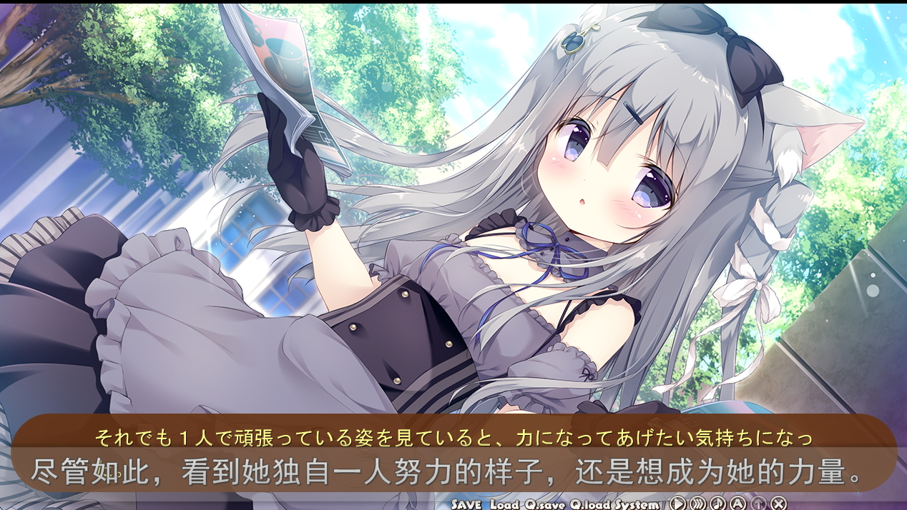

# GalgameSubtitleHooker
use local translation file to output subtitle on screen when hooking out text from Galgame.

effect：run game with auto subtitle. support auto, skip and jump etc action.

How to Use:

1. get ready for jpdic.txt and put into same direct with Textractor.exe, which includes the texts extracted from game (Not supply tools Here, you can find them in FuckGalEngine so on.).
2. get ready for zhdic.txt and put into same direct with Textractor.exe, which includes the texts translated from jpdic.txt .
3. start the textractor and load "ExampleExtension-CLI+subtitle.dll", start and hook the galgame.
4. if CLI and subtitle do not show the text got in zhdic.txt, check whether the text in jpdic.txt **completely** match sentence hooked from game.('「そだよ」'　does not match 'そだよ' )
5. If you want to shutdown CLI or subtitle, just change the dll loaded to 'ExampleExtension-CLI.dll' or 'ExampleExtension-subtitle.dll'.

base on：

<https://github.com/ultrapre/Example-Extension> 

main hooker project

https://github.com/Artikash/Textractor

local translation extension（load 2 utf-8 txt and build a hash map，and send target sentence out to GDI+ subtitle）

<https://github.com/Artikash/Example-Extension> 

GDI+ subtitle

https://github.com/beausoft/desktop-draw-lrc

